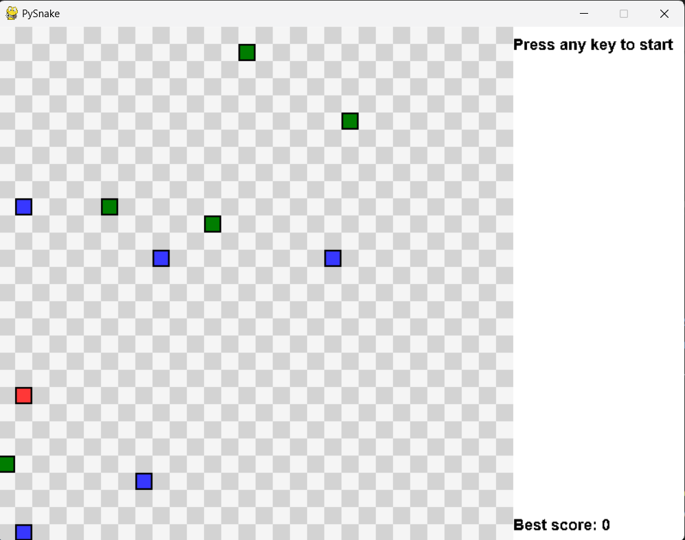
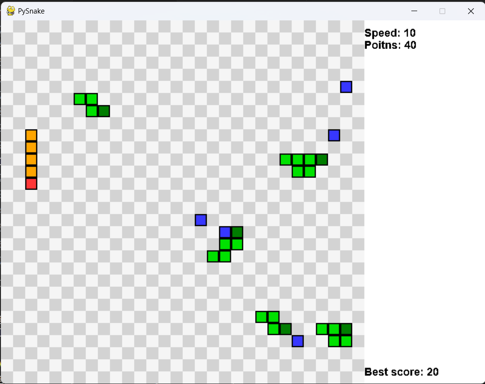

Joguinho de snake para treinar POO

O jogo é composto por:
- User Snake (vermelho)
- PySnakes (verdes)
- Comidas (azuis)

Jogo inicia com 5 pySnakes e 5 comidas.

Início do jogo

Durante o jogo

Features implementadas até agora:
- O valor dos pontos recebidos quando o usuário come uma comida é igual ao valor da velocidade naquele instante.
- A pontuação atual bem como o valor máximo já alcançado é exibido no painel lateral.
- A cada pySnake eliminada a velocidade do jogo aumenta.
- As PySnakes irão evitar contato com o usuário bem como com as outras PySnakes e com elas próprias.
- Se o usuário sair do grid ou tocar alguma PySnake ou nele mesmo o jogo acaba.
- As PySnakes são eleminadas pelos mesmos motivos que levam o jogador a ser eliminado.
- Se todas as PySnakes morrerem o jogo continua apenas com o usuário e a velocidade será constante a partir de então.

Ideias de próximas features:
- Tela de menu onde será possível escolher o número de pySnakes, o número de comidas e a velocidade inicial.
- A pontuação de cada comida levará em conta o número de pySnakes, o número de comidas e a velocidade inicial.
- Implementar uma verificação de autenticidade para o valor armazenado no arquivo best_score.txt